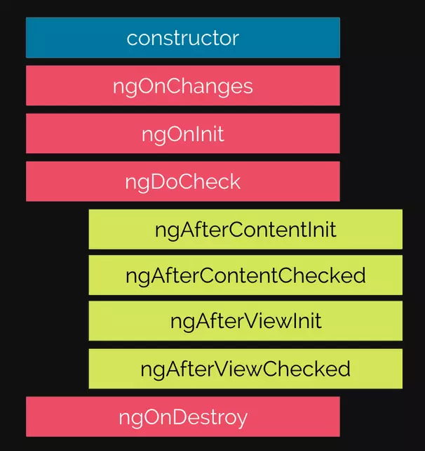

# Lifecycle hooks

Vòng đời của một component hay một directive trong Angular tính từ lúc nó được tạo ra, nó bị thay đổi và bị phá huỷ. Hiểu được vòng đời của component ta có thể viết code can thiệp trong quá trình component hay direct được tạo ra, được cập nhật và phá huỷ.

## Constructor

Được gọi trước tất cả lifecycle hook, thường dùng để tìm các Dependency Injection như các Service.

Chú ý constructor không phải là một hook method

## ngOnChanges

Được gọi khi component phát hiện có giá trị được binding vào component bằng phương pháp Input properties(`@Input`). 

Để nhận biết được giá trị binding thì ngOnChange quản lý đối tượng SimpleChange.

Được gọi trước ngOnInit().

## ngOnInit

Khởi tạo directive/component sau khi hiển thị lần đầu tiên và set các thuộc đầu vào của directive/component.

Chỉ được gọi `một lần duy nhất`, sau khi hook ngOnChanges() được gọi lần đâu tiên.

Dùng để `khởi tạo` các giá trị.

## ngOnDoCheck

ngOnDoCheck được gọi mỗi khi nó phát hiện ra có sự thay đổi dữ liệu ở component. Cho phép ta kiểm tra dữ liệu theo cách thủ công.

Khi sử dụng nó chúng ta nên thận trọng vì nó có thể tạo ra các vấn đề về hiệu suất khi được triển khai không chính xác.

Được gọi sau ngOnChanges và ngOnInit, cứ mỗi lần gọi ngOnChange => sẽ được gọi.

## ngAfterContentInit

Được gọi sau khi component được khởi tạo thành công. Chờ đợi trên các truy vấn ContentChild là trường hợp sử dụng chính của hook.

Thự thi sau khi Angular thêm nội dung bên ngoài vào view của component / view mà directive được đưa vào. Được gọi một lần sau ngDoCheck() đầu tiên.

ContentChild truy vấn các tham chiếu phần tử mang lại cho DOM nội dung. Do đó, chúng sẽ không có sẵn cho đến sau khi DOM nội dung tải. Do đó, tại sao ngAfterContentInit và đối tác của nó ngAfterContentChecked được sử dụng.
Sử dụng ng-content để kiểm tra – Sử dụng ContentChild (Kiểu ElementRef)

## ngAfterContentChecked

Thự thi sau khi Angular đã kiểm tra nội dung bên ngoài đã được đưa vào view của component. Được gọi sau ngAfterContentInit() và mọi ngDoCheck() tiếp theo.

## ngAfterViewInit

Nó tượng tự nhưng ngAfterContentInit but nó được gọi khi component và các component con của nó được khởi tạo thành công. 

Được gọi một lần sau ngAfterContentChecked() đầu tiên.

## ngAfterViewChecked

Phương thức này được gọi sau khi các view component cha và các view của component con được kiểm tra xong. 

Được gọi sau ngAfterViewInit() và mọi ngAfterContentChecked() tiếp theo.

## ngOnDestroy

Dọn dẹp ngay trước khi Angular phá hủy directive / component. Hủy đăng ký Observables và tách trình xử lý sự kiện để tránh rò rỉ bộ nhớ. Được gọi ngay trước khi Angular phá hủy directive / component.

