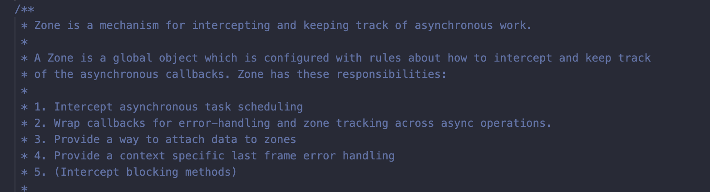
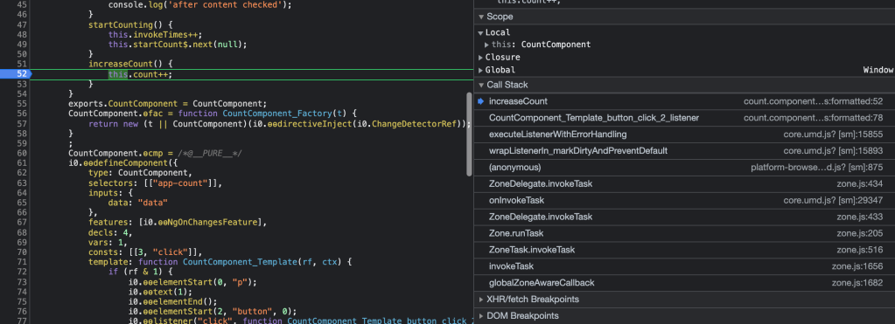
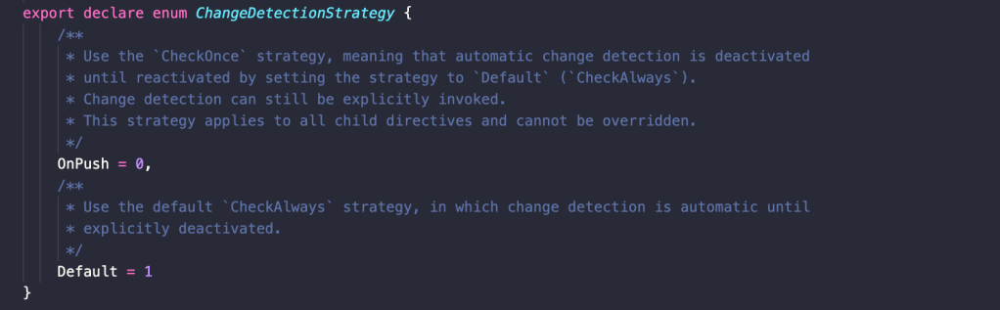

# Zone.js Detect Change

Angular dùng một thư viện gọi là zone.js để detect change với các hàm bất đồng bộ. Hãy hình dung nếu thiếu zone.js thì chuyện gì sẽ xảy ra? Khi đó lúc khởi tạo component thì Angular vẫn gọi đến change detection và render đúng dữ liệu lên UI với các thao tác đồng bộ, tuy nhiên nếu có hàm bất đồng bộ như get data từ backend, các hàm setTimeout… thì Angular sẽ không biết được là có sự thay đổi giá trị binding.

Vì tầm quan trọng của zone.js mà chúng ta cần hiểu được cơ chế hoạt động của zone.js nếu muốn hiểu sâu hơn về Change Detection.

Trong Angular, các bước này là không cần thiết. Bất cứ khi nào bạn cập nhật dữ liệu, HTML của bạn sẽ được cập nhật tự động.

Một ví dụ tương tự về kích hoạt phát hiện thay đổi có thể được nhìn thấy trong ví dụ về bộ đếm thời gian trong đó cứ sau 100ms giá trị của bộ đếm sẽ được thay đổi, vì bộ phát hiện thay đổi kết quả sẽ kiểm tra dữ liệu trong mẫu sau mỗi 100ms (điều này ảnh hưởng xấu đến hiệu suất, đặc biệt là trong ứng dụng lớn, vì phát hiện thay đổi được kích hoạt trong một thành phần sẽ kích hoạt phát hiện thay đổi trong tất cả các thành phần).



Không phải tự dưng mà các dev “to đầu” ở Google lại phải dùng tới zone.js, trong file zone.d.ts ở trên mô tả khá cặn kẽ các tác dụng của zone.js, có thể hiểu nôm na là nó giúp Angular wrap các hàm bất đồng bộ để có thể kiểm soát được trạng thái của chúng đồng thời giữ được ngữ cảnh thực thi (execution context)

> A zone by itself does not do anything, instead it relies on some other code to route existing platform API through it. (The zone library ships with code which monkey patches all of the browsers’s asynchronous API and redirects them through the zone for interception.)

Vậy thì quay lại ví dụ ở trên, khi chúng ta có 1 button để tăng giá trị counter, khi click 1 lần thì count tăng 1, nhưng làm sao Angular biết được event on_click của button được kích hoạt và thực thi xong mà render lại UI? Chính vì hàm listener của button được “monkey patch” vào zone mà zone.js sẽ biết được lúc nào event này được trigger, lúc nào thì nó chạy xong hàm callback. Từ đó nó sẽ thêm một hàm `detectChanges()` vào cuối để kích hoạt change detection!



Để hiểu rõ hơn vai trò của zone.js, hãy thử loại bỏ zone.js ra khỏi ứng dụng xem điều gì sẽ xảy ra. Có hai chỗ cần sửa để `disable zone.js`

1. Trong file `polyfills.ts` comment dòng code import zone.js
2. Thêm `{ ngZone: ‘noop’ }` vào trong hàm `bootstrapModule` trong file main.ts

Khi đó việc khởi tạo component vẫn gọi các hàm life cycle như cũ, tuy nhiên khi click vào button “increase count” thì count tăng giá trị nhưng giá trị đó không được update lên view. Nguyên nhân là khi thiếu vắng `zone.js`, không có ai gọi tới hàm `detectChanges` để phát hiện sự thay đổi giá trị này. Chúng ta buộc phải trigger bằng tay, dùng hàm `ApplicationRef.tick()`:

```ts
constructor(private app: ApplicationRef) {}

increaseCount() {
    this.count++;
    this.app.tick();
};
```

Hoặc `ChangeDetectorRef.detectChanges()`, lưu ý là khi gọi trực tiếp đến hàm này thì các hàm trong `Life Cycle` của Angular không được gọi đến.

```ts
constructor(private cdr:ChangeDetectorRef) {}

increaseCount() {
    this.count++;
    this.cdr.detectChanges();
};
```

Nếu bạn tìm hiểu sâu hơn một chút về `Change Detection` sẽ thấy có 2 “chiến lược” phát hiện thay đổi, đó là:



1. `Default`: là `CheckAlways`, hay là “luôn luôn lắng nghe, luôn luôn thấu hiểu”. `Change Detection` là tự động dựa vào zone.js như đã nói ở trên.

2. OnPush: là checkOnce, tức “chỉ một lần này thôi nhé”. Nó chỉ chạy `Change Detection` lúc đầu tiên khi component khởi tạo. Sau đó chỉ có 2 trường hợp là được trigger `Change Detection`: một là thay đổi của Input của component (về giá trị nếu là immutable, hoặc reference nếu là mutable, aka, object), hai là từ event của template như onClick, onMousemove…

Tại sao có chế độ `OnPush`? bởi vì ở chế độ `Default Change Detection` run rất thường xuyên và có thể ảnh hưởng tới tốc độ trang. Trong nhiều bài viết, OnPush strategy được khuyến cáo dùng để tăng performance, vì Change Detection chỉ được chạy trong 2 trường hợp nói trên. Lưu ý là khi một component được set ở chế độ OnPush, thì tất cả children của nó cũng được set OnPush và không thể override ở component con thành Default được.

Vậy thì điều rút ra ở đây là OnPush strategy sẽ giúp chúng ta kiểm soát được hiệu quả hơn Change Detection, để nó không làm ảnh hưởng tới performance, nhưng ta cần chú ý xử lý việc update changes lên view, chẳng hạn nếu dùng OnPush thì các operation sau không tự động update được giá trị mới lên view.

```ts
of(1).subscribe((val) => (this.count = val));
setTimeout(() => this.count++, 0);
```

Nên khi bạn update được data mới rồi nhưng không thấy màn hình thay đổi theo thì đừng hoảng mà hãy handle như chúng ta đã nói ở trên nhé 🙂

## NgZone run() và runOutsideOfAngular()

Từ tài liệu chính thức của Angular: “ Trong khi `Zone.js` có thể giám sát tất cả các trạng thái của hoạt động đồng bộ và không đồng bộ, Angular cũng cung cấp thêm một dịch vụ gọi là `NgZone`. Dịch vụ này tạo một khu vực được đặt tên angular để tự động kích hoạt phát hiện thay đổi. ”

### NgZone.run ()

Zone xử lý hầu hết các API không đồng bộ như `setTimeout()`, `Promise.then()` và `addEventListenner`. Do đó, bạn không cần phải kích hoạt phát hiện thay đổi cho chúng theo cách thủ công.

Vẫn còn một số API của bên thứ ba mà Zone không xử lý. Trong những trường hợp đó, dịch vụ `NgZone` cung cấp phương thức `run()` cho phép bạn thực thi một hàm bên trong vùng góc.

```ts
export class AppComponent implements OnInit {
  constructor(private ngZone: NgZone) {}
  ngOnInit() {
    // New async API is not handled by Zone, so you need to
    // use ngZone.run() to make the asynchronous operation in the angular zone
    // and trigger change detection automatically.
    this.ngZone.run(() => {
      someNewAsyncAPI(() => {
        // update the data of the component
      });
    });
  }
}
```

Chức năng này và tất cả các hoạt động không đồng bộ trong chức năng đó, sẽ tự động kích hoạt phát hiện thay đổi vào đúng thời điểm.

### runOutsideAngular

Một trường hợp phổ biến khác là khi bạn không muốn kích hoạt tính năng phát hiện thay đổi. Điều này đạt được bằng cách sử dụng một phương thức `NgZone` khác: `runOutsideAngular()`.

Giả sử chúng ta có một hoạt ảnh trong ứng dụng, tức là phần tử <div> đơn giản thay đổi nền của nó cứ sau 50 ms bằng cách sử dụng setInterval đơn giản.

```ts
mport { Component, OnInit, ViewChild, ElementRef, NgZone, ChangeDetectorRef } from '@angular/core';
@Component({
    selector: 'app-animated-div',
    template: `<div #div></div>`,
    styleUrls: ['./animated-div.component.scss']
})
export class AnimatedDivComponent implements OnInit {
    @ViewChild('div', { static: true }) div: ElementRef
    constructor(private ngZone: NgZone) { }
    ngOnInit(): void {
        this.changeColor();
    }
    private setRandomColor() {
    return ['red', 'orange', 'yellow', 'green', 'blue', 'purple'][Math.random() * 6 | 0];
    }
    private changeColor() {
    setInterval(_ => this.div.nativeElement.style.background = this.setRandomColor(), 50)
}
}
```

Hãy tưởng tượng điều gì sẽ xảy ra nếu ứng dụng của bạn có hơn 1000 thành phần. Trong tất cả chúng, phát hiện thay đổi sẽ được kích hoạt sau mỗi `50ms`, điều này sẽ ảnh hưởng đáng kể đến hiệu suất .

Tuy nhiên, như bạn có thể giả định, có một cách đơn giản để khắc phục nó. Bạn chỉ có thể bọc nó bằng `NgZone.runOutsideAngular` như thế này:

```ts
ngOnInit(): void {
   this.ngZone.runOutsideAngular( _ => {
   this.changeColor()
   })
}
```

Chúng ta hãy xem hình dung của chiến lược Mặc định phát hiện thay đổi. Giả sử trình khởi tạo quá trình phát hiện thay đổi trong cây thành phần là thành phần “1” (một sự kiện nhấp chuột đã được kích hoạt).

### Chiến lược phát hiện thay đổi OnPush

Chiến lược phát hiện thay đổi `OnPush` cung cấp khả năng bỏ qua các kiểm tra không cần thiết đối với thành phần và tất cả các thành phần con của nó. Nếu chúng tôi thay đổi chiến lược cho thành phần “A” thành `OnPush` và kích hoạt phát hiện thay đổi từ thành phần “1”, thì tính năng phát hiện thay đổi sẽ không hoạt động đối với các thành phần “A”, “B” và “C”.

GIF tiếp theo thể hiện việc bỏ qua các phần của cây thành phần bằng cách sử dụng chiến lược phát hiện thay đổi `OnPush`:

Bạn có thể kiểm tra các biến thể khác nhau trên ví dụ này tại đây .

Khi sử dụng chiến lược `OnPush`, Angular sẽ cập nhật thành phần nếu:

1. Tham chiếu đầu vào đã thay đổi

```ts
@Component({
  selector: "child",
  template: `
    <h1>{{ object.name }}</h1>
    {{ runChangeDetection }}
  `,
  changeDetection: ChangeDetectionStrategy.OnPush,
})
export class TooltipComponent {
  @Input() object;
  get runChangeDetection() {
    console.log("Checking the view");
    return true;
  }
}
@Component({
  selector: "app-root",
  template: `
    <child [object]="object"></child>
    <button (click)="onClick()">Click</button>
  `,
})
export class AppComponent {
  object = { name: "Angular" };
  onClick() {
    this.object.name = "React";
  }
}
```

```ts
/** Returns false in our case */
if (oldValue !== newValue) {
  runChangeDetection();
}
```

```ts
onClick() {
    this.object = {
    name: 'React'
    }
}
```

2. Một sự kiện bên trong một thành phần hoặc con cháu của nó

Thành phần có trạng thái bên trong, trạng thái này được cập nhật khi một sự kiện xảy ra từ chính thành phần đó hoặc con cháu của nó.

```ts
@Component({
  template: `
    <button (click)="increase()">Click</button>
    {{ count }}
  `,
  changeDetection: ChangeDetectionStrategy.OnPush,
})
export class CounterComponent {
  count = 0;
  increase() {
    this.count++;
  }
}
```

Khi chúng tôi nhấp vào nút, Angular bắt đầu chu kỳ phát hiện thay đổi và chế độ xem được cập nhật như mong đợi.

Có lẽ bạn nghĩ rằng tất cả các hoạt động không đồng bộ sẽ kích hoạt cơ chế phát hiện thay đổi, như đã đề cập ở phần đầu. Nhưng đối với chiến lược `OnPush`, quy tắc chỉ áp dụng cho các `sự kiện DOM`.

```ts
@Component({
  template: `...`,
  changeDetection: ChangeDetectionStrategy.OnPush,
})
export class CounterComponent {
  count = 0;
  constructor() {
    setTimeout(() => this.count++, 0);
    setInterval(() => this.count++, 100);
    Promise.resolve().then(() => (this.count = 10));
    this.http.get("https://count.com").subscribe((res) => {
      this.count = res;
    });
  }
}
```

**Lưu ý rằng thuộc tính count đã thay đổi, nhưng sẽ không có thay đổi nào trong HTML, chúng tôi nên chạy phát hiện thay đổi theo cách thủ công.**

3. Phát hiện thay đổi được kích hoạt theo cách thủ công

Angular cung cấp ba phương pháp để khởi chạy thủ công cơ chế phát hiện các thay đổi.

- `DetChanges()` yêu cầu Angular bắt đầu phát hiện các thay đổi trong thành phần và các thành phần con của nó (nếu chúng có chiến lược mặc định). Ví dụ trước có thể được viết lại như sau (bây giờ phát hiện thay đổi sẽ được kích hoạt)

```ts
import {
  Component,
  ChangeDetectionStrategy,
  ChangeDetectorRef,
} from "@angular/core";
@Component({
  template: `...`,
  changeDetection: ChangeDetectionStrategy.OnPush,
})
export class CounterComponent {
  count = 0;
  constructor(private cd: ChangeDetectorRef) {
    setTimeout(() => {
      this.count++;
      this.cd.detectChanges();
    }, 0);
    this.http.get("https://count.com").subscribe((res) => {
      this.count = res;
      this.cd.detectChanges();
    });
  }
}
```

`ApplicationRef.tick()` giống như `zone.run()` phát hiện thay đổi trên toàn bộ ứng dụng (ngoại lệ là các nhánh của cây với chiến lược `OnPush`) `markForCheck()` không kích hoạt phát hiện thay đổi. Thay vào đó, nó đánh dấu thành phần và tất cả cha mẹ của nó (bất kể chiến lược của chúng được đặt là gì) mà chúng nên được kiểm tra trong chu kỳ phát hiện thay đổi hiện tại hoặc tiếp theo.

Đường ống không đồng bộ đăng ký đối tượng hoặc lời hứa được quan sát và trả về giá trị cuối cùng cho nó.

```ts
import { Component, OnInit, ChangeDetectionStrategy } from "@angular/core";
import { HttpClient } from "@angular/common/http";
import { Observable } from "rxjs";
import { map } from "rxjs/operators";
@Component({
  selector: "app-b",
  template: ``,
  changeDetection: ChangeDetectionStrategy.OnPush,
})
export class BComponent implements OnInit {
  user$: Observable<string>;
  constructor(private http: HttpClient) {}
  ngOnInit(): void {
    this.user$ = this.http.get("https://randomuser.me/api/").pipe(
      map((res: any): string => {
        return (res = res.results[0].picture.medium);
      })
    );
  }
}
```

